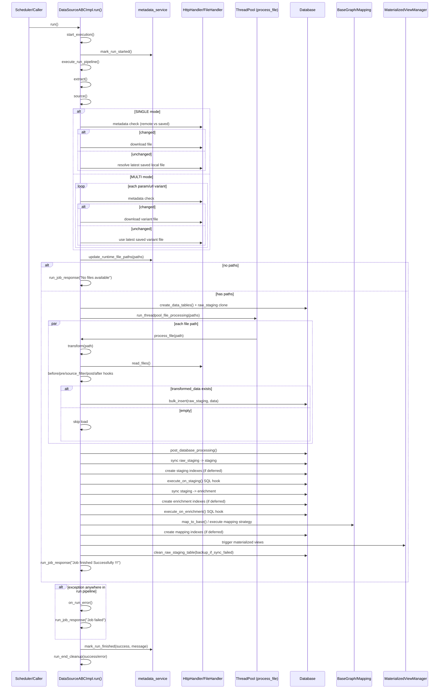

# Spatial ETL Framework

> A config-driven ETL framework for continuously enriching an OpenStreetMap / PostGIS road graph with real-world geospatial data.

[](LICENSE)
[](requirements.txt)
[](Dockerfile)

---

## What it is

Spatial ETL Framework is the Python ETL backend extracted from the [MDP bicycle routing platform](https://github.com/) and released as a standalone project. It pulls geospatial feeds (weather, air quality, tree locations, elevation, accidents, …), stages and cleans them in PostGIS, and spatially joins them onto an OSM road graph — all driven by YAML.

The framework does not care what the downstream consumer is. It writes enrichment tables and updates a base graph; anything (a router, a tile server, a dashboard, a Jupyter notebook) can read from it.

---

## Why it exists

Most geospatial projects end up re-implementing the same plumbing:

- download a file, detect if it changed, store it somewhere sensible;
- parse it, stage it in a database, clean it with some SQL;
- spatially join it onto a base graph (KNN? buffer aggregate? intersection?);
- refresh downstream materialized views in the right order;
- repeat on a schedule.

There are excellent open-source tools for each step (GDAL/OGR, osm2pgsql, Airflow, dbt, FME), but gluing them together for **continuously enriched routing graphs** still means writing bespoke code per dataset. This framework collapses that glue into a single YAML contract: declare the source, pick a spatial-join strategy, and the framework generates the PostGIS SQL for staging, enrichment, and mapping onto the graph.

**Compared to adjacent tools:**

| Tool | What it's for | What this framework adds |
|------|---------------|--------------------------|
| **osm2pgsql / osm2pgrouting** | Load OSM into PostGIS | These are _one_ of the inputs here; we enrich _on top_ of their output |
| **Airflow / Prefect** | General DAG orchestration | Built-in scheduling scoped to geospatial ETL; no DAG authoring needed |
| **dbt** | SQL transformations | Spatial-join strategies are first-class, not user-authored SQL |
| **GDAL/OGR** | Format conversion + raster/vector ops | Used under the hood; framework wraps it behind a config |

---

## What it's used for

- **Context-aware routing** — feed weather, air quality, surface quality, crash history, or tree cover into a bicycle / pedestrian / vehicle router as per-edge attributes.
- **Urban mobility and planning research** — a reproducible way to blend open city data onto a routable graph, so analyses can be re-run as feeds update.
- **Live PostGIS dashboards** — the debug API + materialized views give you a refreshing layer any BI tool (Metabase, Superset, Grafana) can read.
- **A template for other cities** — the Berlin datasources are examples; every source and the graph extent are config-driven.
- **A sandbox for spatial-join strategies** — compare KNN vs. buffer-aggregate vs. intersection enrichments on the same base graph without touching Python.

---

## What it can do

**Extraction**
- Fetch over HTTP / WFS / local file in `single` or `multi` mode (URL variants for batched APIs).
- Skip re-downloads using ETag / Last-Modified metadata checks.
- Process source files in parallel with a thread pool.

**Transformation**
- Pre / post filter hooks around a `read_file_content()` override.
- Bulk insert into a raw-staging clone, with configurable batch size (default 10 000 rows/batch).
- Sync raw-staging → staging → enrichment with SQL hooks at each boundary.

**Spatial mapping** — all config-driven, no Python needed:
- `knn` / `nearest_neighbour` — nearest road segment per feature
- `nearest_k` — K nearest segments per feature
- `within_distance` — features inside a buffer around each segment
- `aggregate_within_distance` — avg / sum / count features within a buffer
- `intersection` — spatial-intersect features and segments
- `attribute_join` — standard SQL JOIN on a shared column
- `sql_template` — parameterised SQL with placeholders
- `custom` — escape hatch: full control via `mapping_db_query()` in your mapper

**Orchestration**
- Per-datasource schedules (cron or interval) declared in YAML.
- Hot-reload: edits to `config.yaml` are picked up in ~2 s without restarting the process.
- Materialized view dependency chains, refreshed in topological order after each run.
- Run-level metadata (started / finished / error) persisted to the database.

**Observability**
- FastAPI debug server for inspecting staging / enrichment / mapping tables and visualising mapping results as GeoJSON.
- Structured run logs and per-datasource run history.

---

## Quick start

**Prerequisites:** Python 3.13+, PostgreSQL 16 with PostGIS 3, or Docker.

```bash
# 1. Bring up a PostGIS container (or use an existing one)
docker run --name postgres \
  -e POSTGRES_PASSWORD=admin123 -e POSTGRES_USER=postgres \
  -p 5432:5432 -d postgis/postgis:16-3.4

# 2. Install deps and run
pip install -r requirements.txt
python3 run.py
```

The pipeline reads `config.yaml`, schedules every enabled datasource, and exposes a debug API on `:8000`. Edits to `config.yaml` reload automatically in ~2 s.

---

## How it works

Each datasource follows the same pipeline, implemented in `main_core/data_source_abc_impl.py`:

```
 Source (HTTP / WFS / file)
        │
        ▼
  read_file_content()          ← override in your mapper (or use built-in)
        │
        ▼
   raw_staging  (DB table)
        │  bulk insert in batches
        ▼
     staging    ─── staging SQL hook
        │
        ▼
   enrichment   ─── enrichment SQL hook
        │
        ▼
   mapping strategy            ← auto-generated PostGIS SQL from YAML
        │
        ▼
   ways_base    (enriched road graph)
        │
        ▼
   materialized views refresh  (topological order)
```

Full sequence diagram: [ETL sequence diagram](#etl-sequence-diagram) at the bottom of this README.

---

## Adding a new data layer

In most cases, **no Python required** — just YAML.

**1. (Optional) Mapper class** — only needed for non-standard source formats:

```python
# data_mappers/myDataMapper.py
from main_core.data_source_abc_impl import DataSourceABCImpl

class MyDataMapper(DataSourceABCImpl):
    def read_file_content(self, path: str) -> list:
        ...  # parse raw file → list of dicts
```

**2. Datasource config:**

```yaml
# data_source_configs/my_data.yaml
datasources:
  - name: my_data
    enable: true
    class_name: MyDataMapper        # omit to use the generic reader
    debug: {endpoint: my-data}
    source: {fetch: http, url: "https://api.example.com/data.json", response_type: json}
    job:
      trigger: {type: {name: interval, config: {hours: 6}}}
    storage:
      staging:    {table_name: my_staging,    table_schema: test_osm_base_graph}
      enrichment: {table_name: my_enrichment, table_schema: test_osm_base_graph}
    mapping:
      enable: true
      strategy: {type: knn}
      table_name: my_mapping
      table_schema: test_osm_base_graph
```

**3. Register in `config.yaml`:**

```yaml
data_folder: "./data_source_configs/"
datasources:
  - file: my_data.yaml
```

The pipeline picks up the change in ~2 s and starts the first run.

---

## Repository layout

```
spatial-etl-framework/
├── run.py                        # Entry point + config watcher
├── config.yaml                   # Single source of truth
├── core/                         # FastAPI server, scheduler, debug API
├── main_core/                    # Base mapper class + config loader
├── data_mappers/                 # One file per datasource
├── data_source_configs/          # Per-datasource YAML configs
├── materialized_views/           # MV dependency + refresh orchestration
├── database/                     # DB utilities + connection pool
├── readers/                      # Format readers (CSV, JSON, GeoJSON, raster, …)
├── handlers/                     # HTTP / file download + metadata checks
├── graph/                        # Base graph integration (OSM tables)
├── docs/                         # Reference documentation (see below)
└── Dockerfile                    # PostGIS image used for local dev
```

---

## Documentation

| Doc | What's in it |
|-----|--------------|
| [Config README](docs/config-README.md) | `config.yaml` structure, per-section options |
| [Config reference](docs/config-reference.md) | Full reference of every config field |
| [Mapper README](docs/mapper-README.md) | Mapper discovery, lifecycle, override points |
| [Mapping strategies reference](docs/mapping-strategies-reference.md) | All spatial-join strategies with examples |
| [Mapping quick reference](docs/mapping-quick-reference.md) | One-page cheat sheet |
| [Migration example: tree mapper](docs/migration-example-tree-mapper.md) | Real migration from custom SQL to a built-in strategy |
| [Batch processing](docs/BATCH_PROCESSING.md) | Batch-insert sizing and tuning |
| [JSON styling](docs/json_styling.md) | JSONPath conventions for source configs |
| [Mapping improvements summary](docs/MAPPING_IMPROVEMENTS_SUMMARY.md) | What changed in the mapping system and why |

---

## Tech stack

| Layer | Technology |
|-------|-----------|
| Runtime | Python 3.13, FastAPI, APScheduler |
| Data access | SQLAlchemy, psycopg 3 (binary) |
| Database | PostgreSQL 16 + PostGIS 3 |
| OSM ingestion | osm2pgsql, osmium, optionally osm2pgrouting / Imposm 3 |
| Packaging | Dockerfile (PostGIS) |

---

## Contributing

- Add a datasource mapper for your city or a new feed.
- Add a new spatial-join strategy in `main_core/`.
- Improve readers in `readers/` for additional source formats.
- Expand `docs/` with real migration examples.

The framework is used in production for the [MDP bicycle routing platform](https://github.com/) in Berlin; PRs that keep the Berlin datasources working are appreciated.

---

## Reference: operational notes

These are working notes kept alongside the code — useful during setup, not required reading.

### PostGIS raster drivers

```sql
ALTER DATABASE <DB_name> SET postgis.gdal_enabled_drivers TO 'GTiff';
ALTER DATABASE <DB_name> SET postgis.enable_outdb_rasters TO true;
```

See: [Using cloud rasters with PostGIS](https://www.crunchydata.com/blog/using-cloud-rasters-with-postgis).

### Installing PostGIS onto a vanilla Postgres image

```bash
docker exec -it my_postgres_container bash
psql -U postgres -c "SELECT version();"
apt-get update
apt-get install -y postgis postgresql-<version>-postgis-3
```

### Postgres driver

The project uses `psycopg 3` (binary) for Python 3.13 — `psycopg2` is not supported out of the box.

```bash
pip install "psycopg[binary]"
```

SQLAlchemy URL prefix: `postgresql+psycopg://…`. If you need `psycopg2`, install it separately and change the prefix to `postgresql+psycopg2://…`.

### OSM tooling cheatsheet

Convert PBF → OSM:
```bash
brew install osmium-tool
osmium cat ./data_berlin.pbf -o ./berlin_latest.osm
```

Extract a bounding box:
```bash
osmium extract -b 13.30760,52.50644,13.33860,52.51802 \
  --strategy=complete_ways -o ernst_extract.osm berlin.osm
```

Load OSM into PostGIS (`osm2pgsql`):
```bash
osm2pgsql -c -d osm_bbox_berlin -p berlin --number-processes=4 \
  -U postgres -P 5433 -W -H localhost ./raw/map_extract.osm \
  -r osm -S default.style --latlong
```

Build a routing topology (`osm2pgrouting`):
```bash
osm2pgrouting -f ./raw/map_extract.osm -d osm_bbox_berlin \
  -U postgres -W admin123 -p 5433 -c mapconfig.xml \
  --prefix routing --tags --addnodes --schema pgrouting
```

For large extracts, [Imposm 3](https://github.com/omniscale/imposm3) is faster than `osm2pgsql`. For a routing-engine comparison (Valhalla, GraphHopper, pgRouting), see [ImpOsm2pgRouting](https://github.com/makinacorpus/ImpOsm2pgRouting).

### Roadmap / TODO

- Auto-install `hstore` + `postgis` extensions on container start.
- Bundle `osm2pgrouting` into the base image.
- Ship a default compose file so `docker compose up` is the one-command start.

---

## ETL sequence diagram


