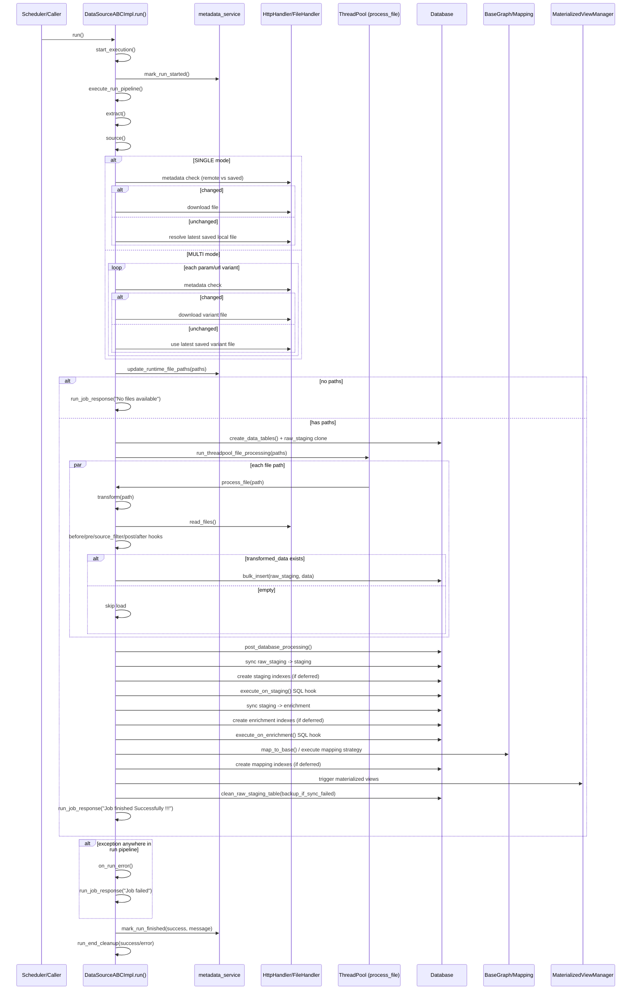

# Docker container for postgis extension

* TODO: add the hstore, postgis extension to docker container at start
* TODO: Add for the command line osm2pgrouting


### To change the file format from pbf to osm and the tool described to do it.
functions in postgis or upload information directly in POSTGIS with GDAL

Follow the steps [currently used for Elevation mapper]
```aiignore

ALTER DATABASE <DB_name>
  SET postgis.gdal_enabled_drivers TO 'GTiff';

ALTER DATABASE <DB_name>
  SET postgis.enable_outdb_rasters TO true;

```

FYI : https://www.crunchydata.com/blog/using-cloud-rasters-with-postgis
---------
run the conatiner 
```
docker run --name postgres -e POSTGRES_PASSWORD=admin123 -e POSTGRES_USER=postgres -p 5432:5432 -d postgres

```
install official postgres container and install postgis or any other plugin oon top of it too make it more light and no need to have unwanted plugins installed 

```aiignore
# check postgres version 
# make sure to have a bash activated inside the container
docker exec -it my_postgres_container bash
psql -U postgres -c "SELECT version();"
---------------------------
apt-get update
apt-get install -y postgis postgresql-{postgres version}-postgis-3
```

TODO:
* at initial startup create the database and schema as default with the extensions installed


# Configure db driver 

currently not supported psycopg2 so we install the version 3 available in binary for the python version 3.13

` pip install "psycopg[binary]"`

for the url mention "postgresql+psycopg" if still want to use psycopg2 install all the required packages and change the url
to "postgresql+psycopg2"

# Converting PBF to osm TOOL
### Install cli tool for the conversion for MAc and Linux terminal
`brew install osmium-tool`


### convert using
`osmium cat ./tmp/osm_graph/data_berlin.osm_2026-01-18T11-47-07.pbf -o ./tmp/osm_graph/berlin_latest.osm`


# For osm2pgrouting - main base table ways and ways_node

` osm2pgrouting -f ./raw/map_extract.osm -d osm_bbox_berlin -U postgres -W admin123 -p 5433 -c mapconfig.xml --prefix routing --tags --addnodes --schema pgrouting`


# for the preperation osm2pgsql 

` osm2pgsql -c -d osm_bbox_berlin -p berlin --number-processes=4 -U postgres -P 5433 -W -H localhost ./raw/map_extract.osm -r 'osm' -S default.style --latlong`

File can be changed to store certain tags and remove certain tags 

NOTE: Alternatively use Imposum 3 as it is way faster and effecient 


[https://github.com/makinacorpus/ImpOsm2pgRouting](https://github.com/makinacorpus/ImpOsm2pgRouting) look for benchmark between different routing machines, valhala, graphopper and other routing machines


# For osmium CLi tool -> to extract a small area from berlin osm file

`osmium extract -b 13.30760,52.50644,13.33860,52.51802 --strategy=complete_ways -o ernst_extract.osm berlin.osm`


## Datasource `run()` ETL flow

Source: `main_core/data_source_abc_impl.py`

### Core process stages

1. Start run timer and mark datasource run as started in metadata.
2. Extract input file paths from source config (`single` or `multi` fetch mode, metadata-aware download skip).
3. Stop early if no input files are available.
4. Create/prepare persistence tables (staging, enrichment, mapping, raw staging clone).
5. Process files in parallel (threadpool):
   - transform each file (read -> pre/post filter hooks -> filter),
   - load transformed data to raw staging.
6. Finalize database pipeline:
   - sync raw staging -> staging,
   - run staging SQL hook,
   - sync staging -> enrichment,
   - run enrichment SQL hook,
   - run mapping strategy to base (if enabled),
   - trigger materialized view refresh flow,
   - cleanup raw staging table.
7. Mark metadata run as finished (success/failure), run end cleanup hook, return job response.

### Sequence diagram


