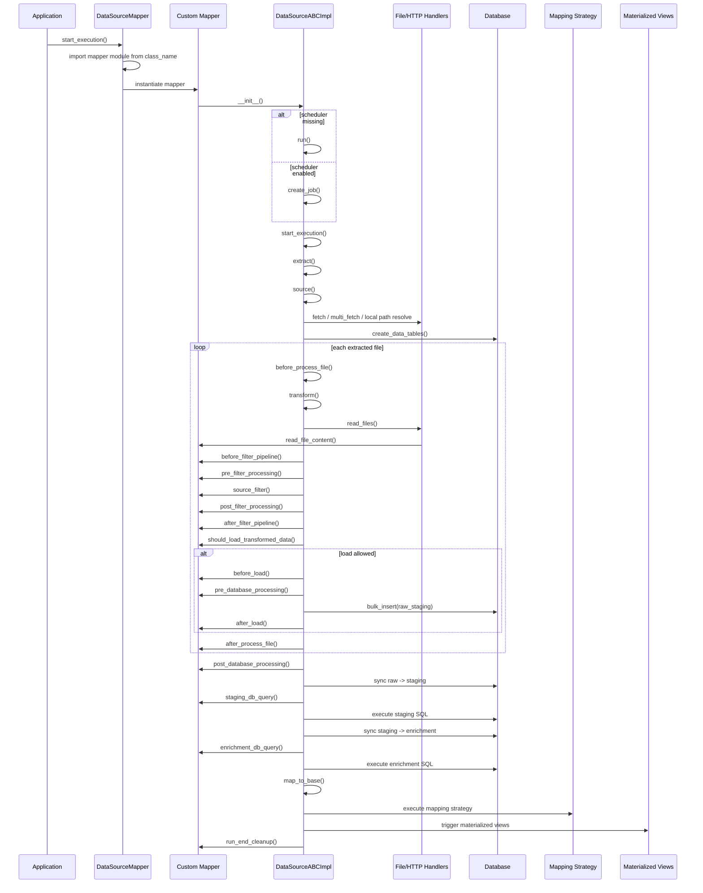
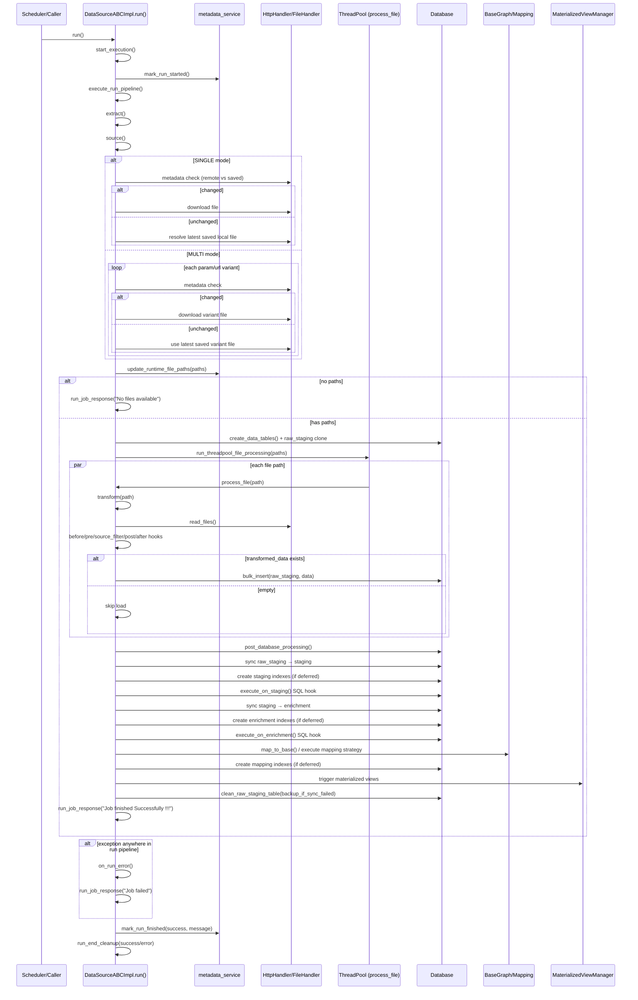

# Mapper README

This document explains how datasource mappers are discovered, how `DataSourceABCImpl` runs them, which functions you can implement in a mapper class, and in which order those functions are called.

Main files:

- [main_core/data_source_mapper.py](../main_core/data_source_mapper.py) — discovers and instantiates mapper classes
- [main_core/data_source_abc_impl.py](../main_core/data_source_abc_impl.py) — base class with all lifecycle hooks
- [main_core/data_source_abc.py](../main_core/data_source_abc.py) — abstract method definitions

## How mapper loading works

The pipeline creates a `DataSourceMapper` instance and passes in the datasource list from `config.yaml`.

For each enabled datasource:

1. `class_name` is read from config.
2. The code imports `data_mappers/{class_name}Mapper.py`.
3. It instantiates `{ClassName}Mapper`.
4. That mapper must inherit from `DataSourceABCImpl`.

Examples:

| `class_name` in config | Expected file | Expected class |
|---|---|---|
| `weather` | `data_mappers/weatherMapper.py` | `WeatherMapper` |
| `pleasantBicycling` | `data_mappers/pleasantBicyclingMapper.py` | `PleasantBicyclingMapper` |
| `tree` | `data_mappers/treeMapper.py` | `TreeMapper` |

## What `DataSourceABCImpl` does

`DataSourceABCImpl` is the base ETL implementation for almost every datasource in this project. It already provides:

1. source extraction
2. metadata-aware download skipping
3. multi-fetch expansion
4. file reading wrapper
5. filtering hooks
6. DB load into raw staging
7. staging and enrichment sync
8. mapping to base graph
9. scheduler job creation
10. metadata tracking
11. materialized view triggering

Most mapper classes only implement the parts specific to their dataset.

## Built-in format reader

`DataSourceABCImpl` ships a format-aware `_auto_read()` method that handles common file types automatically. You do **not** need to override `read_file_content()` for these formats — just set `response_type` in the source config and the base class reads the file for you.

### Supported formats

| `response_type` | Library used | Returns | Notes |
|---|---|---|---|
| `gpkg` | geopandas | `list[dict]` | Geometry column dropped; use override if you need WKB/WKT |
| `shp` | geopandas | `list[dict]` | Same as above |
| `geojson` | geopandas | `list[dict]` | Same as above |
| `parquet` | pandas | `list[dict]` | Columnar; columns become dict keys |
| `csv` | pandas | `list[dict]` | Comma-separated |
| `tsv` | pandas | `list[dict]` | Tab-separated |
| `xlsx` / `xls` | pandas | `list[dict]` | First sheet |
| `json` | orjson (fallback: stdlib json) | `dict` or `list` | Raw parse; `source_filter()` can reshape |
| `gz`, `zip`, `xml`, `pbf` | — | falls through to FileHandler | Use a mapper override for these |

Extension detection priority: `source.response_type` config value → actual file suffix.
For compound types like `json.gz`, the **last** segment wins (`gz`) — the outer container is handled by FileHandler or a mapper override.

### Optional `reader:` config block

For spatial formats you can pass engine and CRS hints without touching Python:

```yaml
source:
  response_type: gpkg
  reader:
    engine: pyogrio      # "pyogrio" (default) or "fiona"
    target_crs: 25833    # EPSG code; auto-reprojects if source CRS differs
```

If `reader:` is omitted, `engine` defaults to `"pyogrio"` and no reprojection is applied.

### No-code datasource example

A CSV datasource with no mapper override:

```yaml
datasources:
  - name: my_stops
    enable: true
    class_name: myStops          # data_mappers/myStopsMapper.py with no read_file_content override
    source:
      fetch: http
      url: "https://example.com/stops.csv"
      response_type: csv
      destination: "tmp/stops/stops.csv"
    storage:
      staging:    {table_name: stops_staging,    table_schema: test_osm_base_graph}
      enrichment: {table_name: stops_enrichment, table_schema: test_osm_base_graph}
    mapping:
      enable: true
      strategy: {type: knn}
      table_name: stops_mapping
      table_schema: test_osm_base_graph
```

The mapper file only needs to exist and inherit from `DataSourceABCImpl`:

```python
from main_core.data_source_abc_impl import DataSourceABCImpl

class MyStopsMapper(DataSourceABCImpl):
    pass   # _auto_read handles csv; no read_file_content needed
```

### GeoPackage with CRS reprojection (no override)

```yaml
source:
  response_type: gpkg
  reader:
    engine: pyogrio
    target_crs: 25833
  destination: "tmp/my_layer/data.gpkg"
```

```python
class MyLayerMapper(DataSourceABCImpl):
    pass   # gpd.read_file() + reproject to EPSG:25833 happens automatically
```

### When you still need to override `read_file_content()`

Override when:
- the format falls through (`gz`, `zip`, `xml`, `pbf`)
- you need geometry in WKB/WKT encoding in the output records
- you need to read multiple files and merge them (e.g. a metrics file + a geometry file)
- the source schema needs column validation before staging

```python
class MyComplexMapper(DataSourceABCImpl):
    def read_file_content(self, path: str) -> list[dict]:
        # custom logic here
        ...
```

---

## Minimum mapper implementation

For formats not handled by the built-in reader, the only method you need is `read_file_content()`.

```python
from main_core.data_source_abc_impl import DataSourceABCImpl


class ExampleMapper(DataSourceABCImpl):
    def read_file_content(self, path: str):
        # Read one file and return either:
        # - list[dict]  ← preferred
        # - dict
        # - str
        return [{"id": 1, "value": "example"}]
```

If the datasource also needs filtering, staging SQL, enrichment SQL, or mapping SQL, you override the corresponding hook.

## Mapper lifecycle order

This is the actual execution order used by `run()`.

### Construction phase

When the mapper object is instantiated:

1. `__init__()`
2. metadata registration
3. scheduler job creation if scheduler exists
4. otherwise `run()` is called immediately

### Run phase

High-level order:

1. `start_execution()`
2. `_mark_metadata_run_started()`
3. `execute_run_pipeline()`
4. `extract()`
5. `source()`
6. `prepare_run_resources()`
7. `process_extracted_paths()`
8. `finalize_after_file_processing()`
9. `run_job_response()`
10. `_mark_metadata_run_finished()`
11. `run_end_cleanup()`

### Per-file phase

For each extracted path:

1. `before_process_file(path)`
2. `transform(path)`
3. `read_files(path)`
4. `read_file_content(path)`
5. `before_filter_pipeline(data, path)`
6. `pre_filter_processing(data)`
7. `source_filter(data)`
8. `post_filter_processing(data)`
9. `after_filter_pipeline(data, path)`
10. `should_load_transformed_data(transformed_data, path)`
11. `load(data)`
12. `before_load(data)`
13. `pre_database_processing()`
14. raw insert into raw staging table
15. `after_load(data)`
16. `after_process_file(path, transformed_data)`

### Finalization phase

After all files are processed:

1. `post_database_processing()`
2. `sync_raw_to_staging()`
3. `create_indexes_for_table("staging")`
4. `execute_on_staging()`
5. `staging_db_query()`
6. `sync_staging_to_enrichment()`
7. `create_indexes_for_table("enrichment")`
8. `execute_on_enrichment()`
9. `enrichment_db_query()`
10. `map_to_base()`
11. `execute_mapping_strategy()`
12. one of the registered mapping strategies runs
13. `create_indexes_for_table("mapping")`
14. `after_datasource_success()`
15. `trigger_materialized_views()`
16. `cleanup_after_finalize(sync_result)`
17. `clean_raw_staging_table(...)`

## Available attributes in any mapper method

These attributes are always available on `self` inside any hook:

```python
# Logger (prefixed with datasource name)
self.logger.info(msg)
self.logger.warning(msg)
self.logger.error(msg, exc_info=True)   # includes traceback
self.logger.debug(msg)

# Database
self.db.bulk_insert(table_name, schema, records_list, upsert=True)
self.db.call_sql(sql_string)
self.db.call_sql_batched(sql_string, batch_size=10_000)
self.db.get_table_count(table_name, schema)  # → int
self.db.table_exists(table_name, schema)     # → bool

# Config — table names and schema for each stage
self.data_source_config.storage.staging.table_name
self.data_source_config.storage.staging.table_schema
self.data_source_config.storage.enrichment.table_name
self.data_source_config.storage.enrichment.table_schema
self.data_source_config.mapping.table_name
self.data_source_config.mapping.table_schema

# Datasource identity
self.data_source_name          # "weather_station_bright_sky"
self.job_configuration         # JobConfigurationDTO

# Metadata service
self.metadata_service.has_completed_successfully(datasource_name)  # → bool
self.metadata_service.is_dataset_expired(datasource_name, expires_after)  # → bool

# All other datasource configs (for cross-datasource dependencies)
self.peer_configs               # dict[name → DataSourceDTO]
```

---

## Functions you can write in a mapper

These are the main extension points in `DataSourceABCImpl`.

### Source and transform hooks

| Method | Signature | When to override |
|--------|-----------|-----------------|
| `read_file_content(path)` | `(str) → list[dict]` | Custom/binary format (gz, zip, xml, pbf); WKB geometry needed |
| `source_filter(data)` | `(list\|dict) → list[dict]` | Flatten nested JSON, filter rows, add derived fields |
| `before_filter_pipeline(data, path)` | `(list, str) → None` | Per-file setup before any filtering |
| `pre_filter_processing(data)` | `(list) → None` | Build in-memory index (KDTree) before `source_filter` |
| `post_filter_processing(data)` | `(list) → None` | Post-filter validation or file export |
| `after_filter_pipeline(data, path)` | `(list, str) → None` | Per-file metrics, progress counter |
| `should_load_transformed_data(data, path)` | `(list, str) → bool` | Return `False` to skip DB insert for this file |

### File-level hooks

| Method | Signature | When to override |
|--------|-----------|-----------------|
| `before_process_file(path)` | `(str) → None` | Per-file setup before `transform()` |
| `after_process_file(path, data)` | `(str, list) → None` | Per-file cleanup after `load()` |
| `on_process_file_error(path, error)` | `(str, Exception) → None` | Custom error handling or file quarantine |

### Load and database hooks

| Method | Signature | When to override |
|--------|-----------|-----------------|
| `before_load(data)` | `(list) → None` | Final row mutation or validation before bulk insert |
| `pre_database_processing()` | `() → None` | DB-side prep before bulk insert |
| `after_load(data)` | `(list) → None` | Stats, reset per-file state |
| `post_database_processing()` | `() → None` | Flush in-memory results accumulated across all files |
| `load(data)` | `(list) → None` | Override entirely to skip DB (keep data in memory) |

### Staging hook

| Method | Signature | When to override |
|--------|-----------|-----------------|
| `staging_db_query()` | `() → str \| None` | Return SQL to run after raw→staging sync; `None` skips stage |
| `sync_raw_to_staging()` | `() → dict` | Override for custom deduplication or aggregation on sync |

```python
def staging_db_query(self) -> str | None:
    stg = self.data_source_config.storage.staging
    return f"""
        UPDATE {stg.table_schema}.{stg.table_name}
        SET geom_4326 = ST_SetSRID(ST_MakePoint(lon, lat), 4326)
        WHERE lon IS NOT NULL AND geom_4326 IS NULL
    """
```

### Enrichment hook

| Method | Signature | When to override |
|--------|-----------|-----------------|
| `enrichment_db_query()` | `() → str \| None` | Return SQL to run after staging→enrichment sync; `None` skips stage |
| `sync_staging_to_enrichment()` | override | Custom aggregation on sync (hourly rollup, spatial grid) |

```python
# Real example from weatherStationMapper.py
def enrichment_db_query(self) -> str | None:
    staging = self.data_source_config.storage.staging
    enrichment = self.data_source_config.storage.enrichment
    return f"""
        UPDATE {enrichment.table_schema}.{enrichment.table_name} e
        SET point = ST_SetSRID(ST_MakePoint(s.lon, s.lat), 4326)
        FROM {staging.table_schema}.{staging.table_name} s
        WHERE e.dwd_station_id = s.dwd_station_id
          AND e.point IS NULL
    """
```

```python
# Real example from airQualityDataMapper.py — CRS transform
def enrichment_db_query(self) -> str | None:
    enrichment = self.data_source_config.storage.enrichment
    return f"""
        UPDATE {enrichment.table_schema}.{enrichment.table_name}
        SET geom_4326 = ST_Transform(geom_25833, 4326)
        WHERE geom_25833 IS NOT NULL AND geom_4326 IS NULL
    """
```

### Mapping hook

| Method | Signature | When to override |
|--------|-----------|-----------------|
| `mapping_db_query()` | `() → str \| None` | Full INSERT…SELECT for `strategy.type: custom`; `None` skips |

```python
def mapping_db_query(self) -> str | None:
    enr = self.data_source_config.storage.enrichment
    m = self.data_source_config.mapping
    return f"""
        INSERT INTO {m.table_schema}.{m.table_name}
            (way_id, dwd_station_id, distance)
        SELECT DISTINCT ON (e.dwd_station_id)
            w.id,
            e.dwd_station_id,
            ST_Distance(w.geometry_25833, e.point::geometry) AS distance
        FROM {enr.table_schema}.{enr.table_name} e
        CROSS JOIN LATERAL (
            SELECT id, geometry_25833
            FROM {m.table_schema}.ways_base
            ORDER BY geometry_25833 <-> e.point::geometry
            LIMIT 1
        ) w
        ON CONFLICT (way_id) DO UPDATE SET
            dwd_station_id = EXCLUDED.dwd_station_id,
            distance        = EXCLUDED.distance
    """
```

### Run-level hooks

| Method | Signature | When to override |
|--------|-----------|-----------------|
| `run_end_cleanup(succeeded, error)` | `(bool, Exception\|None) → None` | Always fires — temp file cleanup, memory release |
| `check_before_update()` | `() → bool` | Return `False` to abort run before extraction starts |
| `after_datasource_success()` | `() → None` | Extra success-side effects (notify external system) |
| `on_run_error(error)` | `(Exception) → None` | Custom run-level error reporting |
| `prepare_run_resources(paths)` | `(list) → None` | Extra setup before file processing starts |
| `get_process_file_worker_count()` | `() → int` | Control thread pool parallelism |

## Mapping strategies

Built-in mapping modes in [data_source_abc_impl.py](/Users/krutarthparwal/Documents/mdp/modular-data-pipeline/main_core/data_source_abc_impl.py):

### Control strategies
- `custom` — calls mapper's `mapping_db_query()` (full SQL control)
- `sql_template` — uses `mapping.config.sql` template with `{mapping_table}`, `{enrichment_table}` placeholders
- `none` — skips mapping entirely

### Spatial strategies (auto-generate PostGIS SQL)
- `knn` / `nearest_neighbour` — nearest road segment per feature
- `within_distance` — all features within a buffer radius
- `intersection` — spatially intersecting features
- `nearest_k` / `knn_multiple` — K nearest road segments per feature
- `aggregate_within_distance` / `buffer_aggregate` — aggregate features within buffer per road

### Non-spatial strategies
- `attribute_join` / `id_join` — standard SQL JOIN on a shared column (no geometry)

### Strategy config examples

```yaml
# nearest_k — 5 nearest stations per road
mapping:
  strategy:
    type: nearest_k
    k: 5
    base_geometry_column: geometry
    enrichment_geometry_column: point
    order_by_sql: "ST_Distance({base_geometry}::geography, {enrichment_geometry}::geography)"
```

```yaml
# aggregate_within_distance — all trees within 50 m per road
mapping:
  strategy:
    type: aggregate_within_distance
    max_distance: 50
    aggregation_type: jsonb_agg
    aggregation_column: tree_id
    aggregation_alias: nearby_trees
    base_geometry_column: geometry_25833
    enrichment_geometry_column: geometry_25833
```

```yaml
# attribute_join — join on shared OSM id column
mapping:
  strategy:
    type: attribute_join
    link_on:
      base_column: osm_id
      mapping_column: external_osm_id
    join_type: INNER
```

## Recommended order when writing a new mapper

Use this order when adding a new datasource mapper:

1. Create the mapper file in `data_mappers/`.
2. Add the mapper class inheriting from `DataSourceABCImpl`.
3. Implement `read_file_content()`.
4. Implement `source_filter()` if the source payload is not already row-shaped.
5. Define staging and enrichment SQLAlchemy table classes if persistence is enabled.
6. Add `staging_db_query()` if staging needs normalization SQL.
7. Add `enrichment_db_query()` if enrichment needs derived columns or geometry logic.
8. Add `mapping_db_query()` with `mapping.strategy.type: custom`, or configure `mapping.strategy.type: sql_template` if mapping to `ways_base` is required.
9. Add `run_end_cleanup()` if files or temporary artifacts must be removed.
10. Add the datasource block in `config.yaml`.
11. Enable it only after the table names and mapping strategy are valid.

## Sequence diagram



## Concrete examples already in the repo

1. [data_mappers/weatherMapper.py](../data_mappers/weatherMapper.py) — overrides `source_filter()` to flatten per-station weather arrays
2. [data_mappers/weatherStationMapper.py](../data_mappers/weatherStationMapper.py) — overrides `source_filter()` and `enrichment_db_query()` to build point geometry
3. [data_mappers/airQualityDataMapper.py](../data_mappers/airQualityDataMapper.py) — overrides `read_file_content()` (gzip JSON) and `enrichment_db_query()` (CRS transform)
4. [data_mappers/elevationMapper.py](../data_mappers/elevationMapper.py) — overrides `pre_filter_processing()` (raster sampling) and `post_database_processing()` (flush metrics)
5. [data_mappers/treeMapper.py](../data_mappers/treeMapper.py) — overrides `read_file_content()`; uses `enrichment_operators` in YAML instead of `enrichment_db_query()`

## Practical notes

1. `DataSourceMapper` filters out disabled datasources before import.
2. If the scheduler is not provided, mapper instantiation immediately runs the datasource.
3. `process_file()` uses a thread pool by default.
4. Mapping only runs if `mapping.enable` is `true`.
5. Mapping is skipped when the mapping table row count already equals the base graph row count.

---

## Full ETL sequence diagram

Shows the exact call order from `run()` to materialized view refresh, including multi-file branching and thread pool processing:


