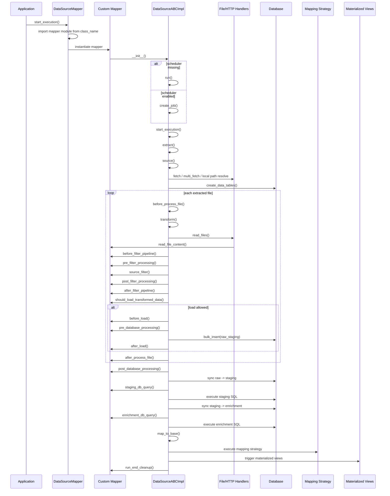

# Mapper README

This document explains how datasource mappers are discovered, how `DataSourceABCImpl` runs them, which functions you can implement in a mapper class, and in which order those functions are called.

Main files:

1. [main_core/data_source_mapper.py](/Users/krutarthparwal/Documents/mdp/modular-data-pipeline/main_core/data_source_mapper.py)
2. [main_core/data_source_abc_impl.py](/Users/krutarthparwal/Documents/mdp/modular-data-pipeline/main_core/data_source_abc_impl.py)
3. [main_core/data_source_abc_impl.py](/Users/krutarthparwal/Documents/mdp/modular-data-pipeline/main_core/data_source_abc_impl.py)
4. [main_core/data_source_abc.py](/Users/krutarthparwal/Documents/mdp/modular-data-pipeline/main_core/data_source_abc.py)

## How mapper loading works

The pipeline creates a `DataSourceMapper` instance and passes in the datasource list from `config.yaml`.

For each enabled datasource:

1. `class_name` is read from config.
2. The code imports `data_mappers/{class_name}Mapper.py`.
3. It instantiates `{ClassName}Mapper`.
4. That mapper must inherit from `DataSourceABCImpl`.

Examples:

| `class_name` in config | Expected file | Expected class |
|---|---|---|
| `weather` | `data_mappers/weatherMapper.py` | `WeatherMapper` |
| `pleasantBicycling` | `data_mappers/pleasantBicyclingMapper.py` | `PleasantBicyclingMapper` |
| `tree` | `data_mappers/treeMapper.py` | `TreeMapper` |

## What `DataSourceABCImpl` does

`DataSourceABCImpl` is the base ETL implementation for almost every datasource in this project. It already provides:

1. source extraction
2. metadata-aware download skipping
3. multi-fetch expansion
4. file reading wrapper
5. filtering hooks
6. DB load into raw staging
7. staging and enrichment sync
8. mapping to base graph
9. scheduler job creation
10. metadata tracking
11. materialized view triggering

Most mapper classes only implement the parts specific to their dataset.

## Minimum mapper implementation

The only method a real mapper almost always needs is `read_file_content()`. That is the dataset-specific parser used by `read_files()`.

Minimal example:

```python
from main_core.data_source_abc_impl import DataSourceABCImpl


class ExampleMapper(DataSourceABCImpl):
    def read_file_content(self, path: str):
        # Read one file and return either:
        # - dict
        # - list[dict]
        # - string
        return [{"id": 1, "value": "example"}]
```

If the datasource also needs filtering, staging SQL, enrichment SQL, or mapping SQL, you override the corresponding hook.

## Mapper lifecycle order

This is the actual execution order used by `run()`.

### Construction phase

When the mapper object is instantiated:

1. `__init__()`
2. metadata registration
3. scheduler job creation if scheduler exists
4. otherwise `run()` is called immediately

### Run phase

High-level order:

1. `start_execution()`
2. `_mark_metadata_run_started()`
3. `execute_run_pipeline()`
4. `extract()`
5. `source()`
6. `prepare_run_resources()`
7. `process_extracted_paths()`
8. `finalize_after_file_processing()`
9. `run_job_response()`
10. `_mark_metadata_run_finished()`
11. `run_end_cleanup()`

### Per-file phase

For each extracted path:

1. `before_process_file(path)`
2. `transform(path)`
3. `read_files(path)`
4. `read_file_content(path)`
5. `before_filter_pipeline(data, path)`
6. `pre_filter_processing(data)`
7. `source_filter(data)`
8. `post_filter_processing(data)`
9. `after_filter_pipeline(data, path)`
10. `should_load_transformed_data(transformed_data, path)`
11. `load(data)`
12. `before_load(data)`
13. `pre_database_processing()`
14. raw insert into raw staging table
15. `after_load(data)`
16. `after_process_file(path, transformed_data)`

### Finalization phase

After all files are processed:

1. `post_database_processing()`
2. `sync_raw_to_staging()`
3. `create_indexes_for_table("staging")`
4. `execute_on_staging()`
5. `staging_db_query()`
6. `sync_staging_to_enrichment()`
7. `create_indexes_for_table("enrichment")`
8. `execute_on_enrichment()`
9. `enrichment_db_query()`
10. `map_to_base()`
11. `execute_mapping_strategy()`
12. one of the registered mapping strategies runs
13. `create_indexes_for_table("mapping")`
14. `after_datasource_success()`
15. `trigger_materialized_views()`
16. `cleanup_after_finalize(sync_result)`
17. `clean_raw_staging_table(...)`

## Functions you can write in a mapper

These are the main extension points in `DataSourceABCImpl`.

### Required in practice

| Function | When to override | What it should do |
|---|---|---|
| `read_file_content(self, path)` | Almost always | Parse one file and return records |

### Source and transform hooks

| Function | When to override | What it should do |
|---|---|---|
| `source_filter(self, data)` | Transform raw parsed payload into row dictionaries | Flatten or normalize data |
| `before_filter_pipeline(self, data, path)` | You need file-aware preprocessing before filter | Mutate or inspect raw parsed data |
| `after_filter_pipeline(self, data, path)` | You need post-filter enrichment | Final cleanups before load |
| `pre_filter_processing(self, data)` | Custom preprocessing | Side effects or mutations before `source_filter` |
| `post_filter_processing(self, data)` | Save or inspect filtered output | Usually export transformed data |
| `should_load_transformed_data(self, transformed_data, path)` | Skip loads under custom rules | Return `False` to skip DB insert |

### File-level hooks

| Function | When to override | What it should do |
|---|---|---|
| `before_process_file(self, path)` | Per-file setup | Temp dir creation, logging, side effects |
| `after_process_file(self, path, transformed_data)` | Per-file teardown or extra work | Cleanup, stats, extra exports |
| `on_process_file_error(self, path, error)` | Special error handling | Cleanup or custom logging |

### Load and database hooks

| Function | When to override | What it should do |
|---|---|---|
| `before_load(self, data)` | You need to mutate/validate before raw insert | Last-mile row preparation |
| `after_load(self, data)` | Extra action after raw insert | Stats or follow-up logic |
| `pre_database_processing(self)` | Work immediately before raw insert | Temp tables or DB prep |
| `post_database_processing(self)` | Work after all raw inserts are complete | Batch cleanup or merge prep |
| `staging_db_query(self)` | You need SQL against staging | Return SQL string |
| `enrichment_db_query(self)` | You need SQL against enrichment | Return SQL string |

### Mapping hooks

| Function | When to override | What it should do |
|---|---|---|
| `mapping_db_query(self)` | Default mapping strategy is SQL from mapper | Return mapping SQL |
### Run-level hooks

| Function | When to override | What it should do |
|---|---|---|
| `prepare_run_resources(self, paths)` | Extra setup before file processing | Additional temp tables or caches |
| `process_extracted_paths(self, paths)` | Custom orchestration beyond threadpool | Replace default file-processing behavior |
| `get_process_file_backend(self)` | Different backend selection | Return custom backend name |
| `get_process_file_worker_count(self)` | Control parallelism | Return worker count |
| `after_datasource_success(self)` | Extra success-side effects | Trigger external systems |
| `run_end_cleanup(self, succeeded, error)` | Always-run cleanup | Delete temp files, release resources |
| `on_run_error(self, error)` | Run-level error behavior | Custom reporting |

## Mapping strategies

Built-in mapping modes in [data_source_abc_impl.py](/Users/krutarthparwal/Documents/mdp/modular-data-pipeline/main_core/data_source_abc_impl.py):

1. `mapper_sql`
2. `sql_template`
3. `none`

Behavior:

1. `mapper_sql`: calls `mapping_db_query()`
2. `sql_template`: reads `mapping.config.sql` from config and formats placeholders
3. `none`: skips mapping

## Recommended order when writing a new mapper

Use this order when adding a new datasource mapper:

1. Create the mapper file in `data_mappers/`.
2. Add the mapper class inheriting from `DataSourceABCImpl`.
3. Implement `read_file_content()`.
4. Implement `source_filter()` if the source payload is not already row-shaped.
5. Define staging and enrichment SQLAlchemy table classes if persistence is enabled.
6. Add `staging_db_query()` if staging needs normalization SQL.
7. Add `enrichment_db_query()` if enrichment needs derived columns or geometry logic.
8. Add `mapping_db_query()` or configure `mapping.strategy.name: sql_template` if mapping to `ways_base` is required.
9. Add `run_end_cleanup()` if files or temporary artifacts must be removed.
10. Add the datasource block in `config.yaml`.
11. Enable it only after the table names and mapping strategy are valid.

## Sequence diagram



## Concrete examples already in the repo

1. [data_mappers/weatherMapper.py](/Users/krutarthparwal/Documents/mdp/modular-data-pipeline/data_mappers/weatherMapper.py): overrides `source_filter()`
2. [data_mappers/pleasantBicyclingMapper.py](/Users/krutarthparwal/Documents/mdp/modular-data-pipeline/data_mappers/pleasantBicyclingMapper.py): overrides `read_file_content()` and `mapping_db_query()`
3. [data_mappers/elevationPythonMapper.py](/Users/krutarthparwal/Documents/mdp/modular-data-pipeline/data_mappers/elevationPythonMapper.py): overrides `pre_filter_processing()` and `post_database_processing()`
4. [data_mappers/treeMapper.py](/Users/krutarthparwal/Documents/mdp/modular-data-pipeline/data_mappers/treeMapper.py): overrides `read_file_content()` and `mapping_db_query()`

## Practical notes

1. `DataSourceMapper` filters out disabled datasources before import.
2. If the scheduler is not provided, mapper instantiation immediately runs the datasource.
3. `process_file()` uses a thread pool by default.
4. Mapping only runs if `mapping.enable` is `true`.
5. Mapping is skipped when the mapping table row count already equals the base graph row count.
